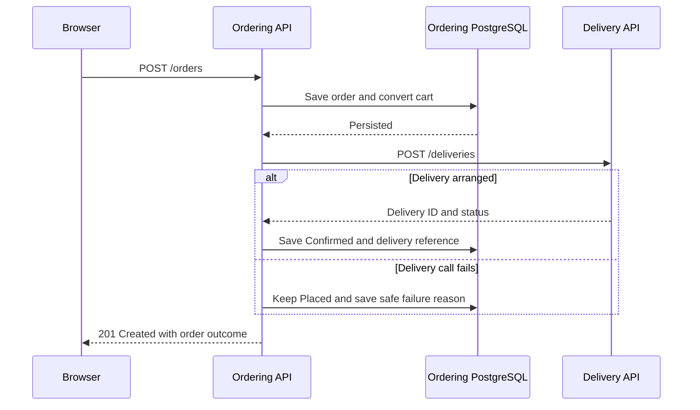

# cronus-ordering-service

Restaurant catalogue, cart and order API for Cronus, a cloud-native food-ordering application.
The service owns ordering data in PostgreSQL and requests delivery through
[cronus-delivery-service](https://github.com/hashirsarwar/cronus-delivery-service).

## Key Features

- Restaurant and menu browsing with active-item filtering.
- Single-restaurant carts with quantity validation.
- Persisted checkout snapshots and order lookup.
- Saved orders with explicit delivery success or customer-safe failure outcomes.
- Database-backed API tests, health checks and optional telemetry.

## Technology stack

.NET, ASP.NET Core, PostgreSQL and Docker.

## Architecture



Ordering saves the order before requesting delivery, then stores the delivery outcome. Each service
owns its database; a failed delivery request leaves the order persisted.

## Quick start

Use the .NET 10 SDK and PostgreSQL on `localhost:5432`. From the repository root:

```bash
createdb cronus_ordering
dotnet restore --locked-mode
dotnet run
```

The Development launch profile serves `http://localhost:5081`.
Startup applies migrations and seeds a sample catalogue when the restaurant table is empty.
Start delivery on port 5082 to exercise delivery confirmation.

Local defaults use the current OS user; PostgreSQL must permit that connection. Supply credentials
through `ConnectionStrings__CronusOrdering` in the environment when required; do not commit them.
Development exposes OpenAPI at `/openapi/v1.json`; [cronus-ordering-service.http](cronus-ordering-service.http)
contains example requests.

Run tests against a **dedicated** database; the suite truncates its tables. Use
`CRONUS_TEST_CONNECTION_STRING` to override the test connection:

```bash
dotnet test tests/Cronus.Ordering.Tests
```

Azure deployment requires private database access, matching Entra grants and separate runtime/migration
identities. GitOps applies migrations before rollout. Keep the API within its intended access boundary;
customer authentication is not configured.

## Related repositories

| Repository | Responsibility |
| --- | --- |
| [cronus-infrastructure](https://github.com/hashirsarwar/cronus-infrastructure) | Azure resources, managed identities and PostgreSQL privilege bootstrap. |
| [cronus-gitops](https://github.com/hashirsarwar/cronus-gitops) | Argo CD bootstrap, Helm charts, Gateway routes and environment-specific deployments. |
| [cronus-delivery-service](https://github.com/hashirsarwar/cronus-delivery-service) | Idempotent delivery creation and lookup in its own database. |
| [cronus-web](https://github.com/hashirsarwar/cronus-web) | Restaurant-to-order browser journey and runtime-configured telemetry. |
